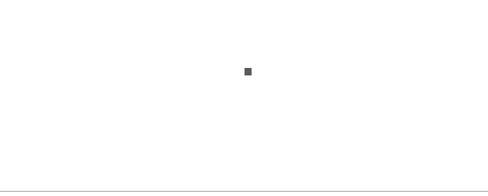
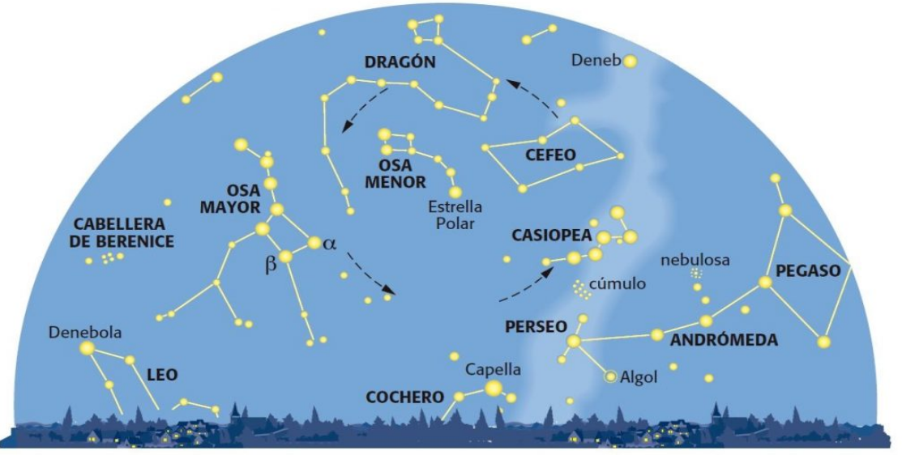
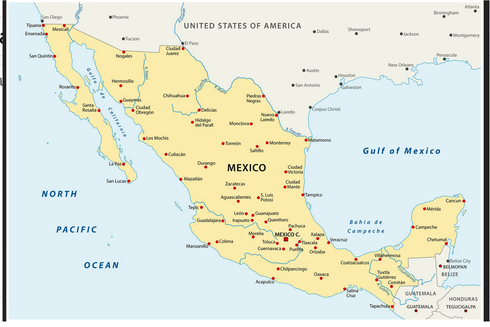
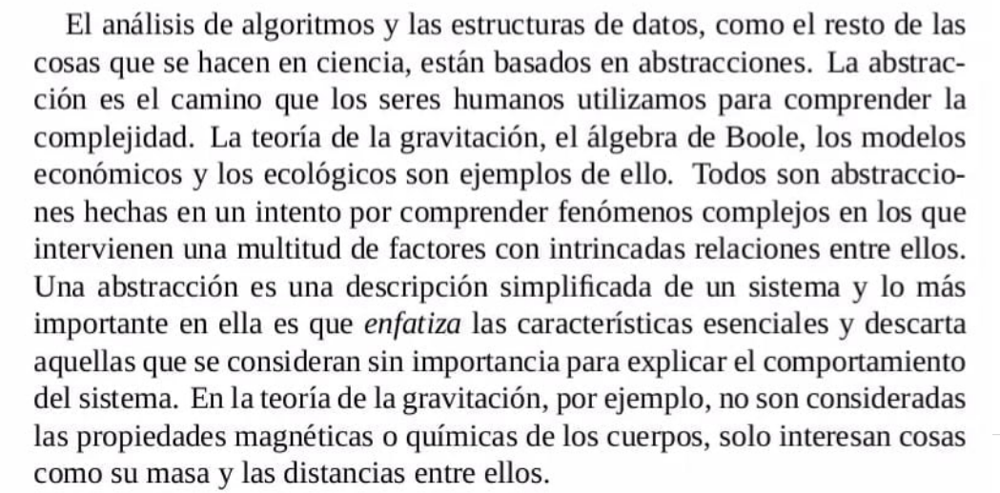
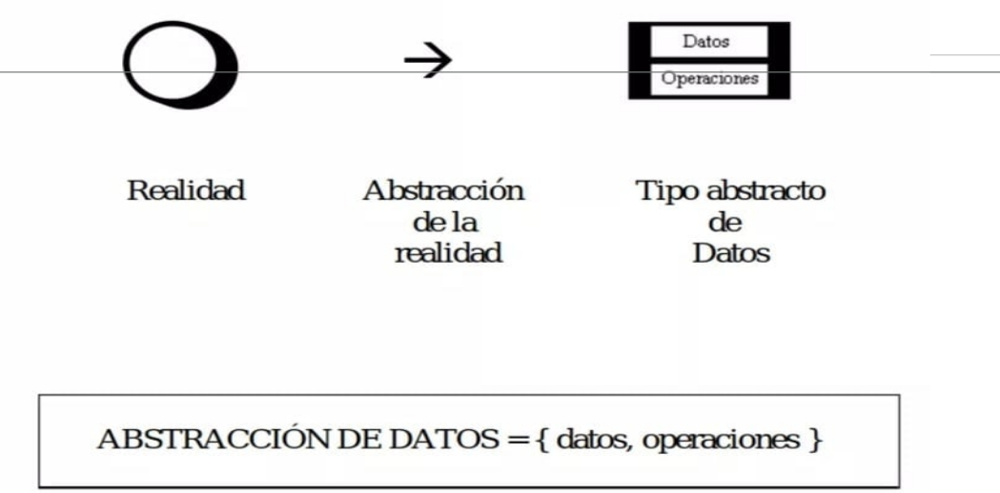
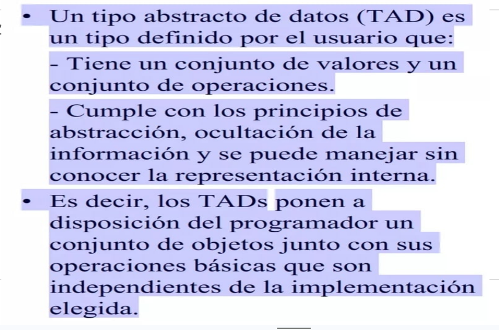
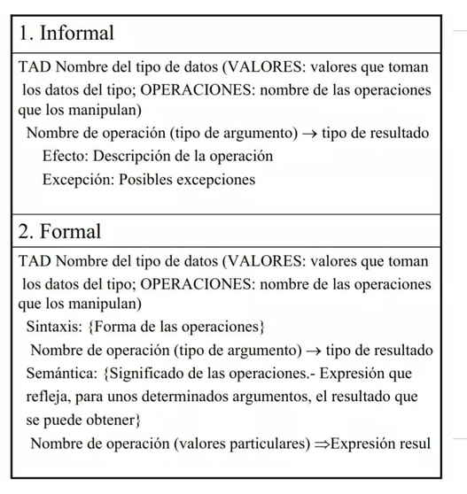
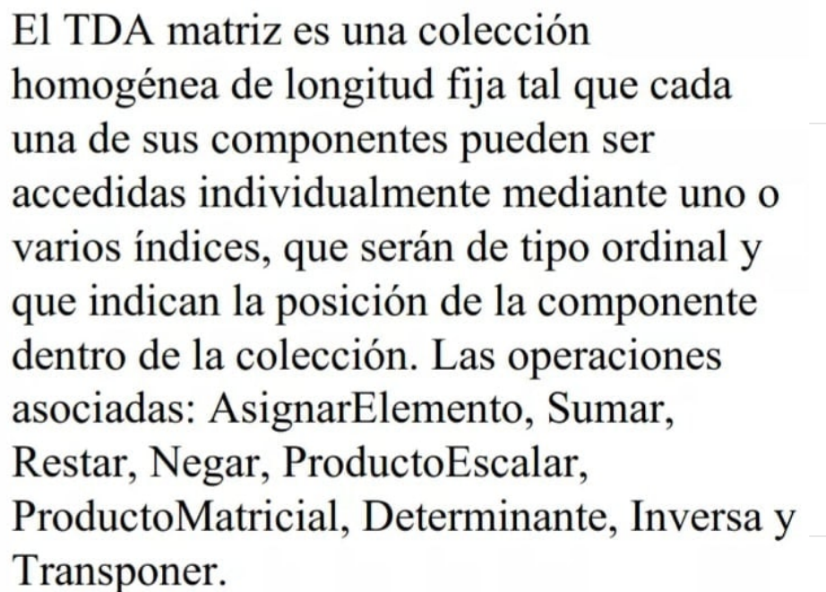
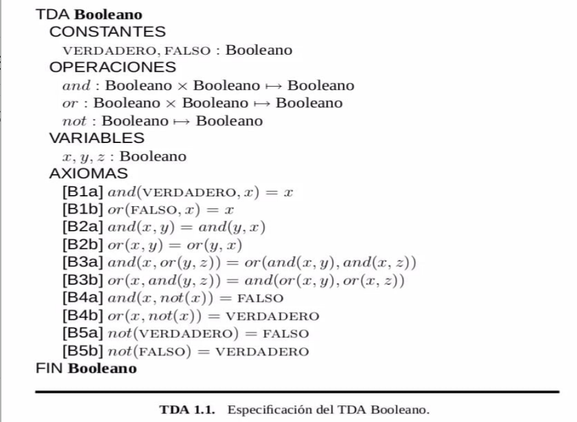

# 1. TDA (Tipo de Dato Abstracto)

## 1.1 ¿Qué es esto?

 
La imagen puede representar un punto.

 
Si a ese punto se "le cambian" las características y el contexto, un punto puede ser una estrella en una constelación, en una galaxia.

 
Si a ese punto se "le cambian" las características y el contexto, un punto puede ser una ciudad, en un mapa de un país, del mundo.

Entonces de alguna manera nosotros decidimos qué representa ese "punto", basta que le asignemos características necesarias dentro de un contexto que nos interesa. Para lograr hacer esa representación, nos ayudamos del concepto de abstracción.

## 1.2 La abstracción
 

## 1.3 Proceso de la abstracción hasta el TDA
 

## 1.4 TDA
 

## 1.5 Tipos de especificación en los TDAs
 

## 1.6 Ejemplos de TDAs
Ejemplo con un lenguaje informal: 
 
Ejemplo con un lenguaje formal: 
 

# Ayudantía teórica
Se hizo un repaso:
1.  ¿Qué es un TDA?
2.  ¿Qué informacion contiene un TDA?
3.  Se realizaron los TDAs Natural, Entero y Fraccion

### Laboratorio
Se hizo un análisis sobre cómo implementar un TDA, surge la propuesta de usar clases abstractas, interfaces y clases convencionales.

Se implementp una clase abstracta Number donde se sintetizan las caracteristicas generales de los números para posteriormente crear una representación de las Fracciones y sus operaciones básicas, suma y producto.
