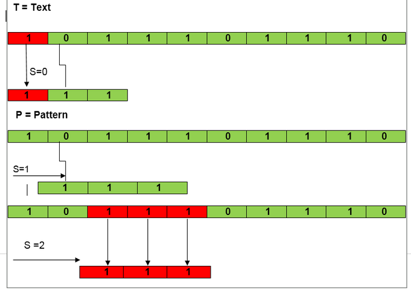
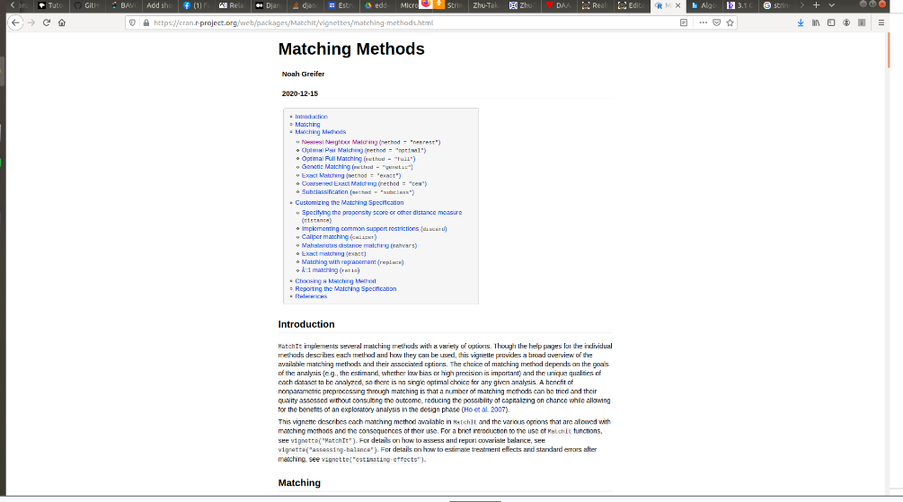
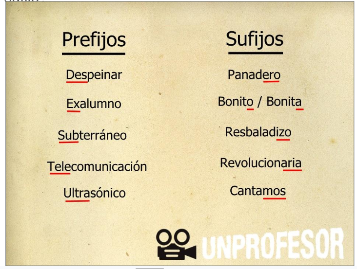
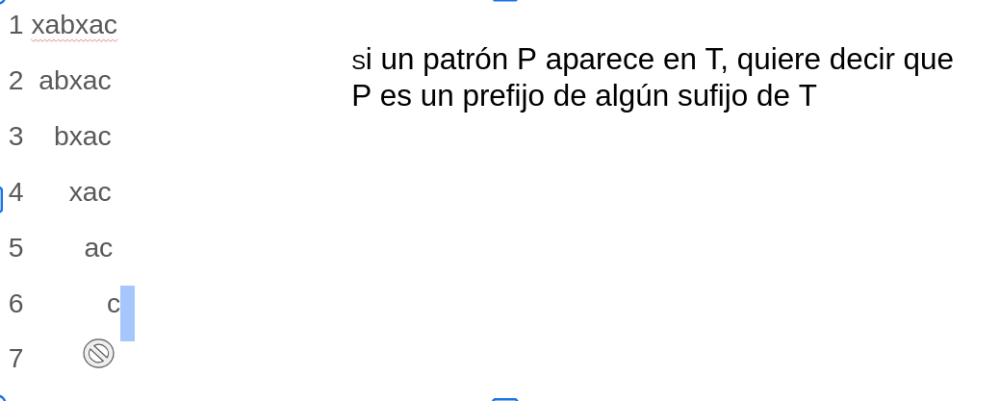
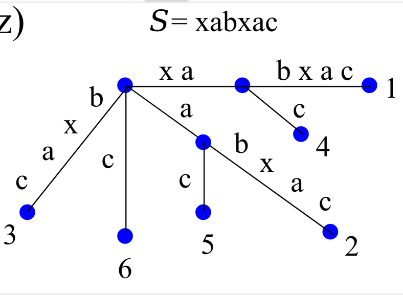
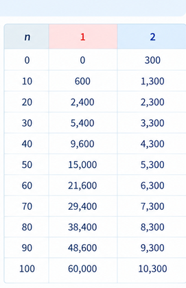
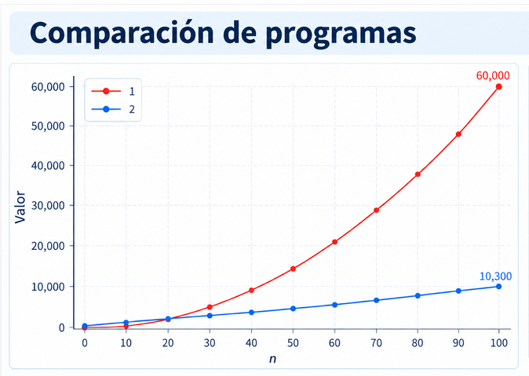

# 2.2 Tiempo de Ejecución de un Programa

## 2.2.1 Motivación

Pensemos en un problema “simple”

**“Quiero encontrar una palabra en un texto”**

Dicho de otra manera:

Sea *P* un patrón y *T* un texto, encontrar las veces que aparece *P* en *T* y saber las posiciones en dónde esto ocurre. Este problema se conoce como “string matching” (apareamiento de cadenas)

## 2.2.2. Diferentes soluciones para un mismo algoritmo

**Algoritmo 1**. Diseñando el algoritmo para string matching 
 

Si hacemos una búsqueda de soluciones para este problema, veremos que hay muchas posibilidades. 
 

**Algoritmo2.** Árboles sufijos

¿Qué es un sufijo? 
 

¿Cuántos sufijos tiene el texto T=“xabxac” P=xaz?
 

Esta seria la manera de representar a todos los sufijos en un árbol
 

## 2.2.3 Eligiendo un algoritmo para resolver un problema

Elegir un algoritmo que es fácil de entender, codificar, “debuggear” 
vs 
Elegir un algoritmo que hace un uso eficiente de los recursos de la computadora y particularmente que corre tan rápido como le es posible. 

## 2.2.4 Medida del tiempo de ejecución de un programa

El tiempo de ejecución depende de varios factores.
- La entrada del programa (*)
- La calidad del código que el compilador-intérprete genera (Ejemplo:JVM,compilador de C)
- La naturaleza y velocidad de instrucciones sobre una máquina usada para ejecutar el programa
- S.O.
- El tiempo de complejidad del algoritmo

## 2.2.5 Comparando el tiempo de ejecución de dos programas que resuelven el mismo problema.

Supongamos que tenemos dos programas que resuelven el mismo problema de diferente manera y que, "de algún modo", nos hemos quitado los factores que se mencionan en el punto 2.2.4.
Entonces para dos programas diferentes podemos tener estos valores:
 
Si graficamos esos valores, obtenemos está gráfica:
 

Este método es muy bueno para poder hacer una elección de cuál programa es mejor, sin embargo también tiene desventajas, (las ya mencionadas,necesarias para poderlos programar) entre ellas que no sabemos qué pasa más allá de la **n** probada y que tampoco podemos **probarlos para todas las entradas n**.

## 2.2.5 

