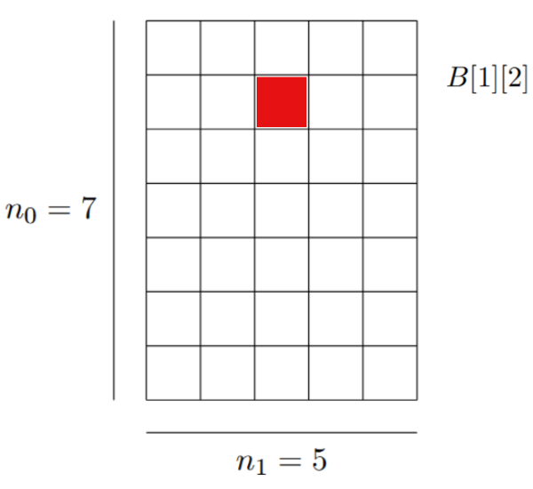

# 2.3 Arreglos

## Definición formal

Los arreglos son estructuras muy sencillas pero útiles y ampliamente utilizadas. Para definirlos adoptaremos dos enfoques, uno formal y otro más práctico. Este último, asociado al uso conceptual de la memoria, nos permitirá comprender el costo computacional de sus operaciones usuales.   
Formalmente un arreglo se puede definir como una función de la siguiente manera: 

En este sentido, un arreglo bidimensional *B* de enteros, de tamaño 7 x 5, sería una función *B: I -> Int* donde *I* es el producto cruz: 

Y, por ejemplo, el elemento B[1][2], en realidad es la función B evaluada en el vector i =(1,2), es decir B(i) = B(1,2) = B[1][2]:

El primer índice (en este caso el 1) nos indica un desplazamiento por la dimensión 1 que mide $n_1=7$, mientras que el segundo índice (en este caso 2) indica cuántas columnas desplazarse a la derecha, es decir, indica un desplazamiento por la dimensión 2, que mide $n_2=5$.  

## Memoria 
Fuera de la disposición física de la memoria en nuestra computadora, como programadores, la estamos acostumbrados a imaginarla como un arreglo unidimensional de celdas con tamaño de 1 byte = 4 bits. Cada celda esta asociada a una dirección $m$ que pertenece a un espacio de direcciones predefinido $m \in [0,M)$. 

 

## Definición práctica
Esta definición se dividirá en tres partes, asumiendo que *X* es algún tipo de dato cuyo tamaño sea *k* bytes:
 - **Celda**: Es una 
 -
 
## Polinomio de direccionamiento 

### De la posición de un arreglo hacia la posición efectiva en memoria

### Desde un arreglo multi-dimensional hacia su posición efectiva en memoria

## Operaciones con arreglos 
