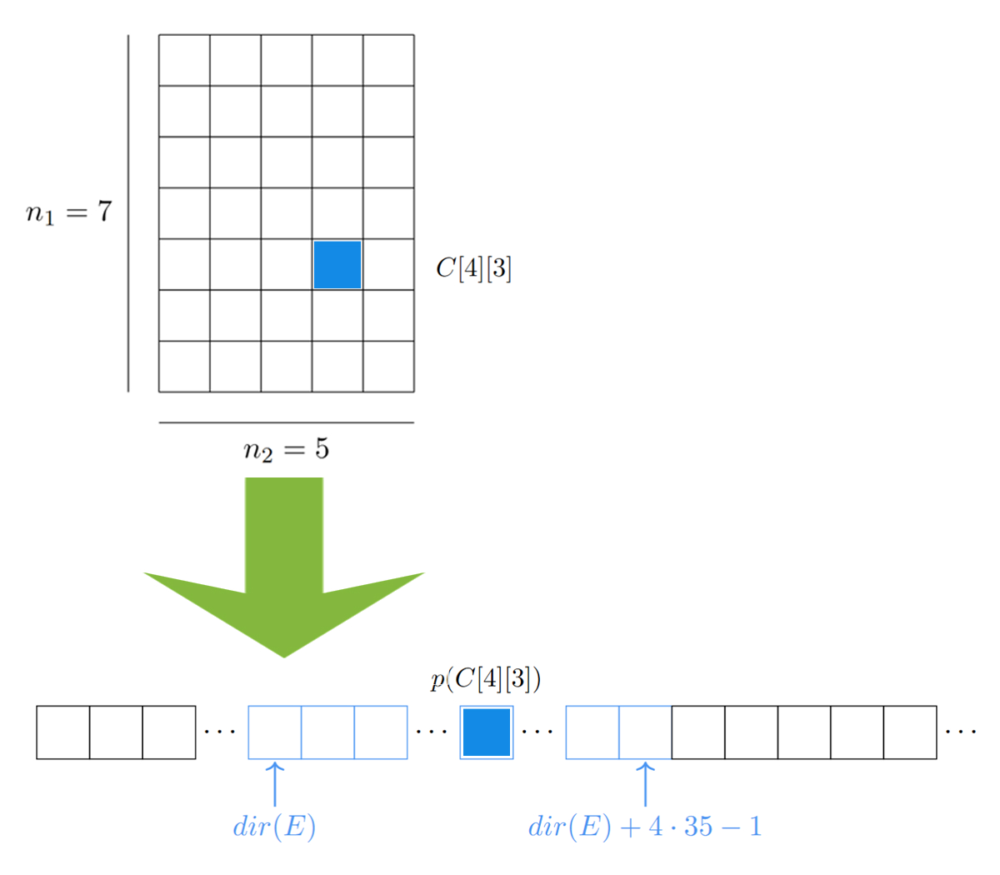

# 2.3 Arreglos

## Definición formal

Los arreglos son estructuras muy sencillas pero útiles y ampliamente utilizadas. Para definirlos adoptaremos dos enfoques, uno formal y otro más práctico. Este último, asociado al uso conceptual de la memoria, nos permitirá comprender el costo computacional de sus operaciones usuales.   
Formalmente un arreglo se puede definir como una función de la siguiente manera: 

En este sentido, un arreglo bidimensional *B* de enteros, de tamaño 7 x 5, sería una función *B: I -> Int* donde *I* es el producto cruz: 

Y, por ejemplo, el elemento B[1][2], en realidad es la función B evaluada en el vector i =(1,2), es decir B(i) = B(1,2) = B[1][2]:

El primer índice (en este caso el 1) nos indica un desplazamiento por la dimensión 1 que mide $n_1=7$, mientras que el segundo índice (en este caso 2) indica cuántas columnas desplazarse a la derecha, es decir, indica un desplazamiento por la dimensión 2, que mide $n_2=5$.  

## Memoria 
Fuera de la disposición física de la memoria en nuestra computadora, como programadores, estamos acostumbrados a imaginarla como un arreglo unidimensional de celdas con tamaño de 1 byte = 4 bits. Cada celda esta asociada a una dirección $m$ que pertenece a un espacio de direcciones predefinido $m \in [0,M)$. 

 

## Definición práctica
Esta definición se dividirá en tres partes, asumiendo que *X* es algún tipo de dato cuyo tamaño sea *k* bytes:
 - **Celda de tipo X**: Es un espacio contiguo en memoria cuyo tamaño
 - **Arreglo unidimensional de tipo X**: Es una colección de $n$ celdas consecutivas de tipo X accesibles mediante un índice $i \in \{0, 1, \ldots, n\}$
 - **Arreglo multidimensional de tipo X y dimensión d**:
     - Si $d = 1$, se trata de un arreglo unidimensional de tipo X.
     - Si $d > 1$, es un arreglo de arreglos multidimensionales de dimensión $d - 1$.
   
## Polinomio de direccionamiento 

### De la posición de un arreglo hacia la posición efectiva en memoria
En lenguajes como Fortran o Pascal todo arreglo, multidimensional o no, se almacenaba en memoria como un arreglo unidimensional. En este contexto el compilador tenía que calcular la posición en memoria, también conocida como la **posición efectiva** de una celda en particular. 

Por ejemplo, si tuviéramos un arreglo unidimensional $C$ de tamaño $n = 9$ y tipo entero (Int). Considerando la celda $C[4]$, para calcular su posición efectiva $pC[4]$ de la celda, a sabiendas de que la dirección en memoria del arreglo $C$ es $dir(C)$:

simplemente tenemos que hacer las siguientes operaciones: 

$$
p(C[4]) = dir(C) + tamaño(Int) \cdot 4 = dir(C) + 4\cdot 4
$$

Recordemos que el tamaño de un dato de tipo Int es de cuatro bytes, por ello es que $tamaño(Int) = 4$. En general para calcular la posición efectiva de una celda C[i] de tipo $X$ es:

$$
p(C[i]) = dir(C) + tamaño(X) \cdot i
$$

Este es nuestro **polinomio de direccionamiento**, una transformación lineal que a partir del índice de una celda nos permite conocer su posición efectiva en memoria. 

### Desde un arreglo multi-dimensional hacia su posición efectiva en memoria
Ahora supongamos que nuestro arreglo $C$ es bidimensional, de tamaño $n = 7 \times 5$ y queremos conocer la posición efectiva de la celda $C[4][3]$ en memoria:

 

Observemos que $i_1 = 4$ y que $i_2 = 3$. La primer entrada de nuestro vector de índices $i_1$ nos dice cuántos renglones bajar. Como cada renglón tiene $n_2 = 5$ celdas, entonces debemos multiplicar $i_1 \cdot n_2 = 4 \cdot 5 = 20$. Esto quiere decir que la dirección en memoria de  

Ahora, supongamos que tenemos un arreglo $E$ tridimensional, de tamaño $n = 7 \cdot 5 \cdot 3$, y de tipo Int. Y queremos encontrar la posición efectiva 
### Polinomio generalizado
Retomando nuestros conceptos de la definición con la que comenzamos esta atención 

## Operaciones con arreglos 
Los arreglos son estructuras estáticas, esto quiere decir que una vez reservada la memoria y asignadas sus celdas a valores específicos, 

## Arreglos escalonados

