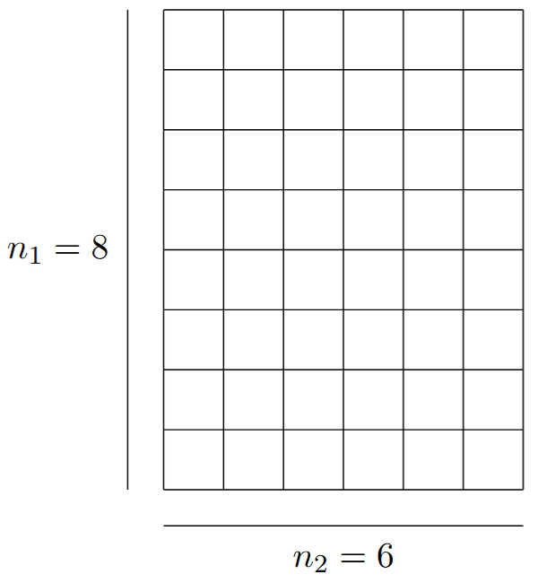
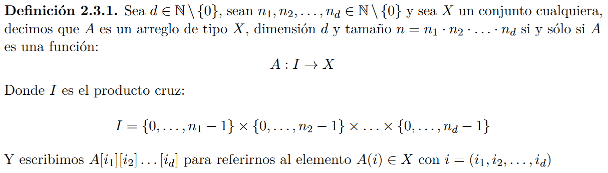
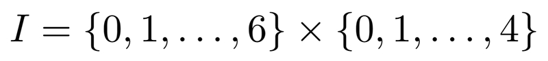
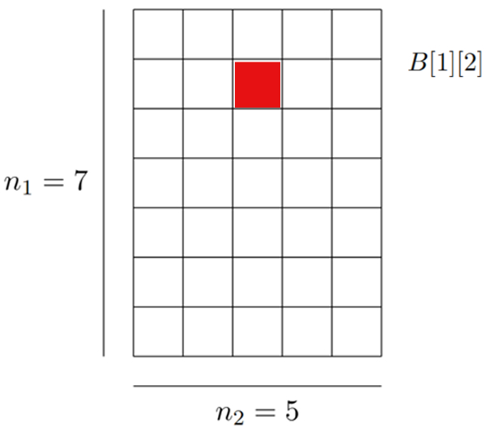
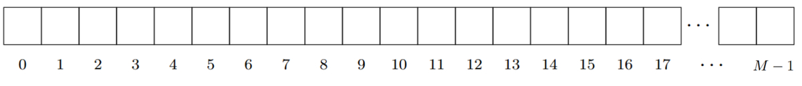
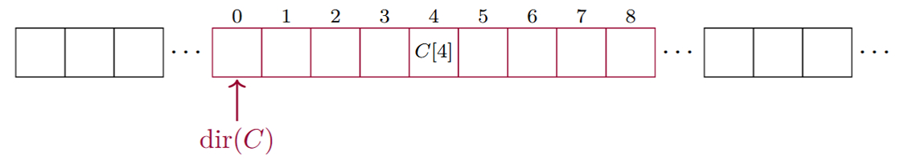
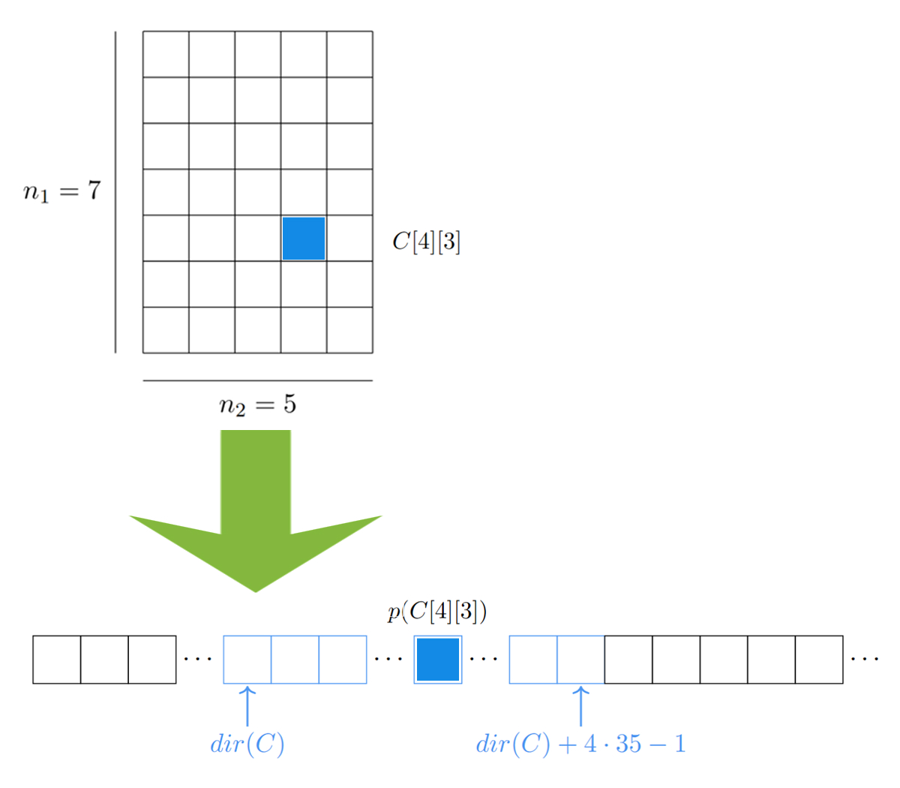
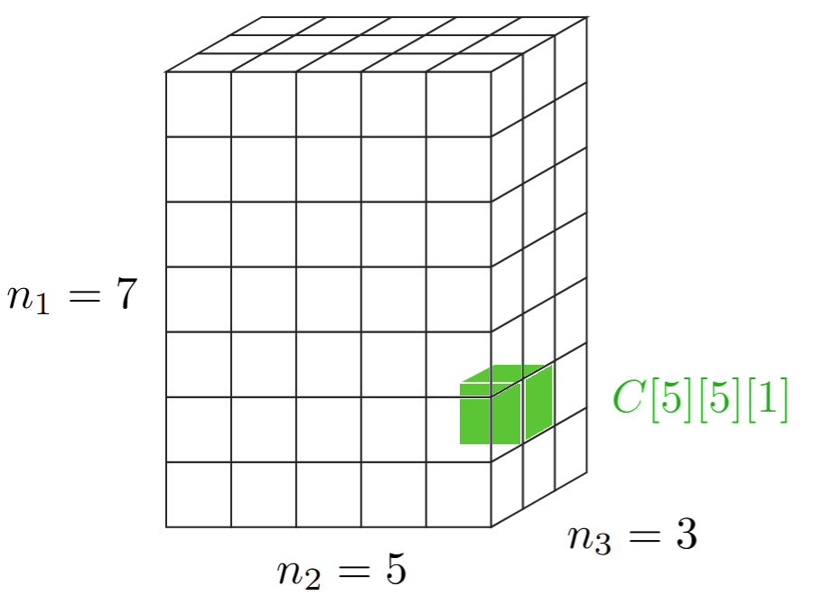
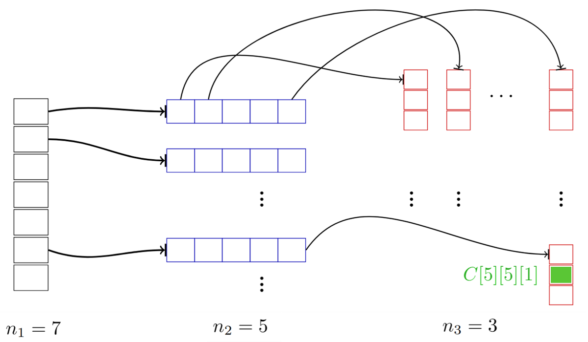
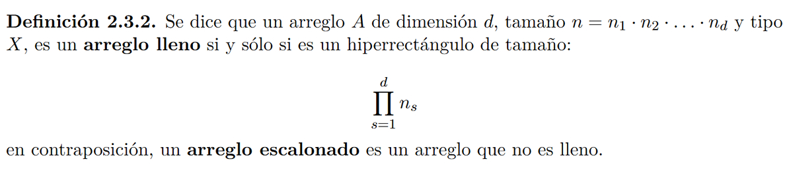

# 4. Arreglos

## Índice
- [Introducción](#0)
- [Definición Formal](#1)
- [Memoria](#2)
- [Definición Práctica](#3)
- [Polinomio de Direccionamiento](#4)
  - [De la posición de un arreglo hacia la posición efectiva en memoria](#4.1)
  - [Desde un arreglo multi-dimensional hacia su posición efectiva en memoria](#4.2)
  - [Polinomio generalizado](#4.3)
- [Operaciones sobre arreglos](#5)
- [Arreglos escalonados](#6)
- [Referencias](#7)
<div id='0' />
  
## Introducción
Los arreglos son estructuras muy sencillas y ampliamente utilizadas. Para definirlos adoptaremos dos enfoques, uno formal y otro más práctico. Este último, asociado al uso conceptual de la memoria, nos permitirá comprender el costo computacional de sus operaciones usuales.  <br>

Intuitivamente un arreglo es una colección contigua de datos de un mismo tipo almacenados en una suerte de cajas que tienen un nombre. Esas cajas suelen llamarse celdas y el nombre de cada una es conocida como su _índice_. En un arreglo $A$, un índice $i$ se refiere a una celda $A[i]$, y mediante esa sintaxis podemos acceder al valor que guarda esa celda. <br>
Cuando pensamos en arreglos de dos dimensiones podemos imaginar matrices cuyas celdas no están indexadas por un único número, sino por un par ordenado $i = (i_1, i_2)$, de modo que, si $B$ es un arreglo bidimensional, escribimos $B[3][4]$ para referirnos al valor de la celda indexada por el par $(3,4)$ en $B$.  <br>

Si consideramos un arreglo tridimensional $C$, las celdas quedarán indexadas por una tripleta ordenada $i = (i_1,i_2,i_3)$, por ejemplo, $C[4][7][8]$ será la sintaxis para referirnos a la celda indexada por la tripleta $(4,7,8)$. Tanto pares ordenados como tripletas ordenadas no son otra cosa que casos particulares de vectores de dos y tres dimensiones respectivamente. De modo que, en general, si tenemos un arreglo de $d$ dimensiones, sus celdas estarán indexadas por vectores de $d$ entradas. Entonces si $D$ es un arreglo de $d$ dimensiones, el término $D[4][2]\ldots[7]$ se refiere a la celda indexada por el vector d-dimensional $(4, 2,\ldots, 7)$, siempre y cuando dicha celda se encuentre en $D$.<br> 

¿Cuándo es que una celda no se encuentra en un arreglo? Cuando las entradas del vector que la indexa no pertenecen al rango permitido. Este rango depende del tamaño que tenga el arreglo en una dimensión dada. Por ejemplo, si tenemos aquel arreglo bidimensional $B$ del párrafo anterior y lo definimos como una matríz de $8 \times 6$, tendremos 8 renglones y 6 columnas; 8 es el tamaño del arreglo en la primer dimensión y 6 es el tamaño del arreglo en la segunda dimensión. 

<div align="center">

</div>

La celda $B[3][4]$ si se encuentra dentro de $B$ porque $3 \in \{0,1,\ldots,7\}$ y $4 \in \{0,1,\ldots, 5\}$. Pero la celda $B[32][91]$ claramente no se encuentra en $B$. Del mismo modo, y aunque menos trivial, $B[8][6]$ no se encuentra en $B$ porque, ambos rangos sólo llegan hasta 7 y 5 respectivamente. Si el o la lectora fuesen tan amables de tomar una hoja de papel y dibujar el arreglo $B$ como la matriz que hemos descrito, colocando los índices correspondientes a cada celda partiendo desde el par ordenado $(0,0)$ podría comprobar de manera más experimental y, a caso lúdica, lo que acabamos de declarar.<br>

<div align="center">

</div>

En general un arreglo tiene tres características principales: 
 - Dimensión $d$
 - Tipo $X$
 - Tamaño $n = n_1 \cdot n_2 \cdot \ldots \cdot n_d$

Donde cada $n_s$ es el tamaño del arreglo en la dimensión $s \in {1\ldots} d$. De este modo hemos definido implícitamente los rángos válidos para las entradas de los vectores que indexan cada celda, ya que la entrada $i_s$ de algún vector $(i_1,\ldots,i_s,\ldots,i_d)$ sólo puede tener valores en el rango $\{0,...,n_s-1\}$. 

Todas estas ideas cobran mayor formalidad en la siguiente sección. 

<div id='1' />
 
 ## Definición formal

La definición formal arroja luz sobre las etiquetas que adoptaremos para referirnos a las características de un arreglo
Formalmente un arreglo se puede definir como una función de la siguiente manera: 

<div align="center">

</div>


En este sentido, un arreglo bidimensional *B* de enteros, de tamaño 7 x 5, sería una función *B: I -> Int* donde *I* es el producto cruz: 

<div align="center">

</div>

Y, por ejemplo, el elemento B[1][2], en realidad es la función B evaluada en el vector i =(1,2), es decir B(i) = B(1,2) = B[1][2]:

<div align="center">

</div>

El primer índice (en este caso el 1) nos indica un desplazamiento por la dimensión 1 que mide $n_1=7$, mientras que el segundo índice (en este caso 2) indica cuántas columnas desplazarse a la derecha, es decir, indica un desplazamiento por la dimensión 2, que mide $n_2=5$.  

<div id='2' />

## Memoria 
Fuera de la disposición física de la memoria en nuestra computadora, como programadores, estamos acostumbrados a imaginarla como un arreglo unidimensional de celdas con tamaño de 1 byte = 4 bits. Cada celda esta asociada a una dirección $m$ que pertenece a un espacio de direcciones predefinido $m \in [0,M)$. 

<div align="center">
 
</div>

<div id='3' />

## Definición práctica
Esta definición se dividirá en tres partes, asumiendo que *X* es algún tipo de dato cuyo tamaño sea *k* bytes:
 - **Celda de tipo X**: Es un espacio contiguo en memoria cuyo tamaño es el mismo que el dato de tipo $X$ que almacena. 
 - **Arreglo unidimensional de tipo X**: Es una colección de $n$ celdas consecutivas de tipo X accesibles mediante un índice $i \in \{0, 1, \ldots, n\}$.
 - **Arreglo multidimensional de tipo X y dimensión d**:
     - Si $d = 1$, se trata de un arreglo unidimensional de tipo X.
     - Si $d > 1$, es un arreglo de arreglos multidimensionales de dimensión $d - 1$.

<div id='4' />
 
## Polinomio de direccionamiento 

<div id='4.1' />
  
### De la posición de un arreglo hacia la posición efectiva en memoria
En lenguajes como Fortran o Pascal todo arreglo, multidimensional o no, se almacenaba en memoria como un arreglo unidimensional. En este contexto el compilador tenía que calcular la posición en memoria, también conocida como la **posición efectiva** de una celda en particular. 

Por ejemplo, si tuviéramos un arreglo unidimensional $C$ de tamaño $n = 9$ y tipo entero (Int). Considerando la celda $C[4]$, para calcular su posición efectiva $pC[4]$ de la celda, a sabiendas de que la dirección en memoria del arreglo $C$ es $dir(C)$:

<div align="center">

</div>

simplemente tenemos que hacer las siguientes operaciones: 

$$
p(C[4]) = dir(C) + tamaño(Int) \cdot 4 = dir(C) + 4\cdot 4
$$

Recordemos que el tamaño de un dato de tipo Int es de cuatro bytes, por ello es que $tamaño(Int) = 4$. En general para calcular la posición efectiva de una celda C[i] de tipo $X$ es:

$$
p(C[i]) = dir(C) + tamaño(X) \cdot i
$$

Este es nuestro **polinomio de direccionamiento**, una transformación lineal que a partir del índice de una celda nos permite conocer su posición efectiva en memoria. 

<div id='4.2' />

### Desde un arreglo multi-dimensional hacia su posición efectiva en memoria
Ahora supongamos que nuestro arreglo $C$ es bidimensional, de tamaño $n = 7 \times 5$ y queremos conocer la posición efectiva de la celda $C[4][3]$ en memoria:

<div align="center">

 
</div>

Observemos que $i_1 = 4$ y que $i_2 = 3$. La primer entrada de nuestro vector de índices $i_1$ nos dice cuántos renglones bajar. Como cada renglón tiene $n_2 = 5$ celdas, entonces debemos multiplicar $i_1 \cdot n_2 = 4 \cdot 5 = 20$. Esto quiere decir que la dirección en memoria de  


Antes de abordar la versión generalizada del polinomio de direccionamiento veamos un último ejemplo. Esta vez pediremos que $C$  sea un arreglo tridimensional, de tamaño $n = 7 \cdot 5 \cdot 3$, y de tipo Int. Supongamos que, dada la celda $C[5][5][1]$: 

<div align="center">

 
</div>

que también podemos visualizar de la siguiente manera,

<div align="center">

 
</div>

en un arreglo de arreglos de arreglos; y que queremos encontrar su posición efectiva $p(C[5][5][1])$ en nuestra memoria, que, como habíamos dicho, puede conceptualizarse como un arreglo unidimensional. <br>
En este caso debemos multiplicar la primer entrada de nuestro vector de índices $i_1 = 5$ por el producto de los tamaños de las dimensiones siguiente $n_2 \times n_3$. Esto nos permite avanzar todas las celdas hasta el punto en el que comienza el $i_1$-ésimo arreglo de dimensión 2 y tamaño $n_2 = 5$. A ese resultado debemos sumarle el producto de la segunda entrada de nuestro vector de índices $i_2 = 5$ por el tamaño del $n_3 = 3$ de los arreglos unidimensionales. Finalmente sumamos la tercer entrada de nuestro vector de índices $i_3 = 1$:

$$i_1 \cdot n_2 \cdot n_3 + i_2 \cdot n_3 + i_3 = 5 \cdot 5  \cdot 3 +  5 \cdot 3  + 1$$

A dicho producto debemos multiplicarlo por el tamaño  en bytes del tipo Int, es decir, por cuatro y, finalmente, sumarle la dirección efectiva del comienzo del arreglo en memoria a la que nos referimos como $dir(C)$. 

<div id='4.3' />
 
### Polinomio generalizado
Retomando nuestros conceptos de la definición con la que comenzamos esta nota, si tenemos un arreglo $A$, de tipo $X$, dimensión $d$, tamaño $n = n_1 \cdot n_2 \cdot \ldots \cdot n_d$ y dirección $dir(A)$ en memoria; el polinomio de direccionamiento que nos da la posición efectiva de la celda $A[i_1][i_2]\ldots[i_d]$ es:

$$p(A[i_1][i_2]\ldots[i_d]) = dir(A) + tamaño(X)\cdot\sum_{t = 1}^{d}i_t\prod_{s=t+1}^{d}n_s$$

donde, por convención, decimos que $\prod_{s=d+1}^{d}n_s = 1$.

<div id='5' />
 
## Operaciones sobre arreglos 
Los arreglos son estructuras estáticas, esto quiere decir que una vez reservada la memoria y asignadas sus celdas a valores específicos, 
obtendremos una estructura que no cambiará en tiempo de ejecución. <br>

La principal desventaja es que tanto **borrar un elemento** como** aumentar el tamaño** de un arreglo dado tomará tiempo lineal $O(n)$ con $n$ el tamaño del arreglo. En el primer caso, supongamos que tenemos un arreglo $A$ de dimensión $d$, y tamaño $n$. <br> 
Para borrar el elemento de una celda, digamos $A[i]$, tendremos que reemplazarlo por el contenido de la celda $A[i+1]$. A su vez, el contenido de la celda $A[i+2]$ debe reemplazar al contenido de la celda $A[i + 1]$ y así sucesivamente hasta que reemplacemos el contenido de la celda $A[n-2]$ por el contenido de la celda $A[n-1]$. En total habremos hecho $(n-1) - (i + 1) + 1 = n - i - 1$. En caso de que  operaciones de copia  consideramos eliminar el contenido de la celda A[0] entonces haríamos $n - 1$ operaciones. <br>
Ahora bien, si queremos aumentar el tamaño del arreglo, $A$ de tipo $X$ y tamaño $n$, al tamaño $n + k$, tenemos que reservar nuevo espacio en la memoria y copiar los $n$ elementos almacenados, operación que tiene un orden lineal O(n).<br>

Dicho lo anterior, la principal bondad de un arreglo radica en que el acceso a cualquier elemento es de orden $O(1)$. De manera más específica, acceder a la posición efectiva de cualquier elemento en un arreglo $A$ requiere del desplazamiento a la posición inicial del arreglo $dir(A)$ y del movimiento a la posición efectiva de la celda en cuestión mediante el polinomio de direccionamiento que depende únicamente de la dimensión $d$ de $A$. <br>

Realmente sólo nos toma $d$ sumas y $2d$ multiplicaciones obtener la posición efectiva buscada.

<div id='6' />

## Arreglos escalonados (ragged arrays)
Al definir un arreglo multidimensional de dimensión $d$, digamos 3, en Java y otros lenguajes modernos, podemos posponer la inicialización de algunos de los subarreglos de dimensión $d - k$ con $k \in \{1,\ldots,d-1\}$:

```
int [][][] arr = new int [7][][];
arr[3] = new int [5][];
arr[3][4] = new int [3];
arr[3][4][2] = 9;

```
En este ejemplo el arreglo `arr[2]` no está inicilaizado por tanto podría decirse que no tiene un tamaño establecido. Si quisiéramos medir el tamaño de este arreglo, podríamos razonar como sigue: <br>

Tenemos un arreglo de tamaño 7 cuya tercer celda está inicializada como un arreglo de cinco celdas, de las cuales sólo la cuarta celda está inicializado como un arreglo unidimensional de tamaño tres que guarda en su última celda un 9. Entonces estamos ocupando un total de 7 + 5 + 3 = 15. Cosa que queda por debajo de $105 = 7 \cdot 5 \cdot 3$ que obtendríamos si el arreglo estuviera lleno. Con esto en mente veamos la siguiente definición: 

<div align="center">

 
</div>


En memoria,  estos arreglos se guardan por separado, a diferencia de como vimos que Fortran o Pascal guardaban los arreglos multidimensionales, en un sólo bloque de memoria. Esto tiene una consecuencia digna de mencionar sobre la **operación de acceso**, que si bien se mantiene en el orden constante $O(1)$, resulta levemente más tardada. <br>

Si quisiéramos, por ejemplo, acceder al 9 que guardamos en `arr[3][4][2]` tendríamos que desplazarnos, primero a la dirección inicial del arreglo $dir(A)$. Posteriormente, tendríamos que desplazarnos a la dirección inicial del arreglo `arr[3]`, luego a la dirección inicial de `arr[3][4]`y finalmente tendríamos que desplazarnos 2 celdas sobre este arreglo para dar con el valor que buscábamos. <br>

En general, para un arreglo $A$ de dimensión d, necesitamos realizar $d$ desplazamientos en memoria, que pese a aparentar ser menos que las $3d$ operaciones aritméticas que mencionamos anteriormente ($d$ sumas y $2d$ multiplicaciones), en toda arquitectura de computadoras la operación de desplazamiento en memoria tiene un mayo costo computacional que las operaciones aritméticas. <br>

En conclusión, acceder al elemento en una celda de un arreglo escalonado es ligeramente más tardado que acceder a la celda de un arreglo lleno. <br>

<div id='7' />

## Referencias

   -Galaviz Casas, José (2012). Estructuras de datos y análisis de algoritmos: Una introducción usando Java. Ciudad de México, México: Facultad de Ciencias, UNAM.

   -Peláez, Canek (2018). Estructuras de datos con Java moderno. Ciudad de México, México: Facultad de Ciencias, UNAM. ISBN: 978-607-30-0966-9.
