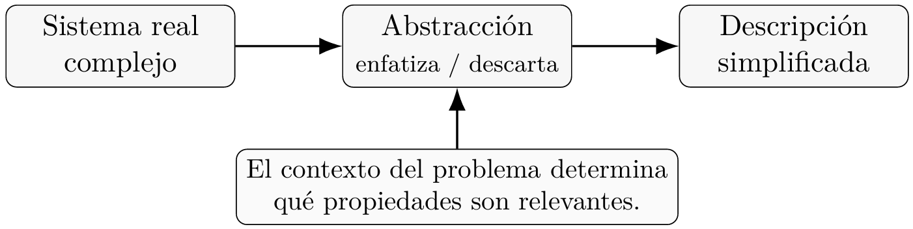
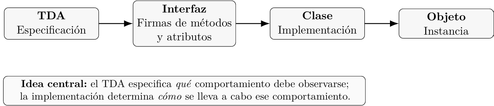
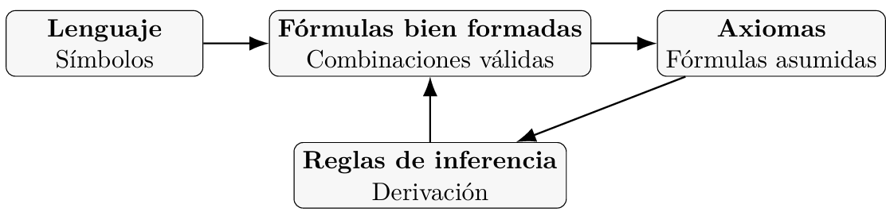
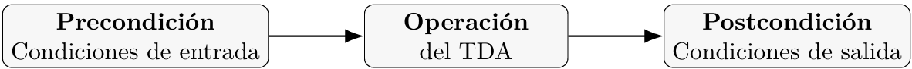

# Facultad de Ciencias UNAM

Estructuras de Datos

Nota1: Tipos de dato abstracto

## Profesora: Virginia Teodosio Procopio Ayudantes: Leonardo Gallo Guerrero José Manuel Madrigal Ramírez

22 de Agosto de 2026

## La abstracción

La abstracción es el camino que utilizamos para entender la complejidad de la realidad. El resultado de ejercer la abstracción es una descripción simplificada de un sistema. Al abstraer llevamos a cabo dos tareas importantes:

- Enfatizar las características esenciales.

- Descartar las que no son relevantes para explicar el comportamiento del sistema.

Por ejemplo:

- En la teoría de la gravitación descartamos las propiedades magnéticas y químicas de los cuerpos para enfatizar la masa y la distancia entre ellos.

- En una caricatura el dibujante captura los rasgos relevantes mediante trazos simples y des- carta los que no se necesitan para entender sin ambigüedad aquello que está representando.

 
*Figura 1: La abstracción como transformación de un sistema complejo en una descripción simplificada.*

## TDA, estructuras de datos, clases y objetos

Programar es un ejercicio de abstracción: definimos los atributos y propiedades de los datos que el programa manipula para resolver un problema. En el paradigma orientado a la representación de objetos, o de manera más corta, paradigma orientado a objetos (POO), modelamos entes abstractos que representan a los actores involucrados en el problema que queremos resolver con nuestro programa.


El programador define los atributos y el comportamiento de esas entidades abstrayendo las propiedades reales según el contexto del problema.

Por ejemplo, no será lo mismo modelar una clase Persona para construir la solución a un problema de censo biométrico en una población que modelar una clase Persona en un programa para registrar la actividad financiera de una región.

En el primer caso la clase Persona tendrá atributos como color de ojos, estatura, huellas dactilares, etc. Mientras que en el segundo caso seguramente le proporcionaremos atributos como ingreso mensual, situación laboral o gastos semanales.

Una vez hecho el ejercicio de abstracción, el programador implementará las ideas principales en una clase cuyas instancias serán representaciones manipulables de las entidades que le interesa modelar.

Esas ideas principales quedan formalizadas en un Tipo de Dato Abstracto.

Los Tipos de Dato Abstracto son entidades teóricas que anteceden toda

implementación.

## Un primer ejemplo: TDA Persona

Para dar un ejemplo ilustrativo de un TDA, supongamos que debemos programar una clase Persona que reciba ciertos atributos como el nombre y la edad. Además incluiremos una operación que permita modificar el nombre.

Antes de implementar la clase Persona, formalizamos la idea que acabamos de describir con pseudocódigo. Así, obtendremos el TDA Persona:

*Listing 1: Especificación del TDA Persona.*

```
TDA Persona
OPERACIONES
crear : Cadena Entero -> Persona
get_nombre : Persona -> Cadena
get_edad : Persona -> Entero
set_nombre : Persona Cadena -> Persona
VARIABLES
p : Persona
n : Cadena
e : Entero
AXIOMAS
[P1] get_nombre(crear(n, e)) = n
[P2] get_edad(crear(n, e)) = e
[P3] get_nombre(set_nombre(p, n)) = n
[P4] get_edad(set_nombre(p, n)) = get_edad(p)
```

## Operaciones como funciones

La línea

```
crear : Cadena Entero -> Persona
```

indica que la operación crear toma una cadena, un entero y nos regresa un TDA Persona.


Dicho de otro modo, el dominio de la operación (o función) crear consiste en el producto cruz del conjunto de las cadenas y los enteros, mientras que su codominio está constituido por elementos del tipo Persona. ¿Eso quiere decir que estamos interpretando los tipos como conjuntos? En efecto, con dos pequeños matices: todos los tipos son conjuntos finitos y no todas las funciones son totales, es decir, hay funciones que no están definidas en algunos elementos del dominio.

Si lo pensamos desde esta perspectiva, cuando declaramos una variable:

int a = 3;

1

es como si dijéramos

Si recordamos la definición de función de nuestras clases de álgebra superior, una función es un conjunto de pares ordenados. Es decir, si el dominio de una función f es el conjunto A y su codominio es B, entonces

f A×B.

En caso de que tengamos una función que tome más de una entrada, como es el caso de nuestra función crear, su dominio es, a su vez, el producto cruz:

Cadena Entero,

y su codominio es el conjunto Persona.

Podríamos pensar en otras funciones que también tomasen como dominio el mismo producto cruz

Cadena Entero

y cuyo codominio también fuese el conjunto Persona.

En realidad tendríamos tantas funciones como subconjuntos del triple producto cruz

Cadena Entero Persona.

El nombre de ese conjunto tan enorme es justamente:

Cadena Entero Persona.

Así, cuando escribimos

crear : Cadena Entero -> Persona,

no queremos decir otra cosa que la etiqueta crear pertenece al conjunto de todas las funciones cuyo dominio es

Cadena Entero

y cuyo codominio es Persona. Dicho de otro modo:

crear (Cadena Entero Persona) .


## Variables como elementos de conjuntos

Si pasamos a la definición de las variables, que se encuentra debajo de la definición de las operaciones:

```
p : Persona, n : Cadena, e : Entero,
```

bajo la interpretación de conjuntos podemos interpretarlas como declaraciones de pertenencia:

```
p Persona, n Cadena, e Entero.
```

## Axiomas y comportamiento

Finalmente tenemos algunos axiomas cuyo fin es definir el comportamiento de las operaciones. Son muy importantes ya que un TDA no dice más que aquello que se puede inferir del comportamiento de sus operaciones.

Como puede observarse, el TDA no da indicación alguna sobre cómo implementar las operaciones, únicamente dice qué se espera de ellas.

## Del TDA a los objetos: interfaz, clase y objeto

El procedimiento de diseño que involucra el TDA, las interfaces, clases y objetos podría visualizarse de la siguiente manera:

Idea central: el TDA especifica qué comportamiento debe observarse;

la implementación determina cómo se lleva a cabo ese comportamiento.

 
*Figura 2: Relación conceptual entre TDA, interfaz, clase y objeto.*

Que el TDA sólo indique qué hacen las operaciones y no cómo lo hacen tiene como consecuencia la separación del comportamiento y el estado interno del programa.

Únicamente tras especificar claramente las operaciones de un TDA podremos considerar estruc- turas de datos que las implementen.

Por ejemplo, una posible implementación de Persona en Java podría ser:

*Listing 2: Una implementación posible del TDA Persona en Java.*

```
1 public class Persona {
2 private String nombre;
3 private int edad;
4
5 public Persona(String nombre, int edad) {
6 this.nombre = nombre;
7 this.edad = edad;
8 }
9
10 public String getNombre() {
11 return nombre;
12 }
13
14 public int getEdad() {
15 return edad;
16 }
17
18 public void setNombre(String nuevoNombre) {
19 nombre = nuevoNombre;
20 }
21 }
```

Esta clase es solamente una implementación posible de la especificación. El TDA no exige que internamente exista exactamente un atributo llamado nombre, ni que la edad se almacene como un int; lo que exige son las propiedades observables establecidas por sus operaciones y axiomas.

## Modularidad en POO

La idea detrás de la programación orientada a objetos es construir módulos suficientemente independientes entre sí para poder componerlos de maneras que formen soluciones para el problema que nos interesa resolver.

Esa modularidad depende de que cada objeto actúe como se espera y que nosotros como programadores tengamos certeza de ello.

Así, cuando queremos componer el módulo X con el Y, desde X no importa si la implementación interna de Y cambió; sólo importa si sigue cumpliendo con la función que X espera.

En POO esta modularidad se condensa en tres prácticas fundamentales:

- Encapsulación. Ocultar los detalles de la implementación de los objetos ofreciendo una interfaz que permita conocer y modificar el estado del objeto. Preserbar la encapsulación es una de las razones por las que utilizamos funciones set() y get() en vez de permitir accesos directos.

- Bajo acoplamiento. Que la funcionalidad de un sistema dependa de los servicios que los objetos proporcionan y no de la manera en que dichos servicios estén implementados.

- Alta cohesión. Que todos los datos requeridos para que un objeto funcione formen parte de los atributos propios del objeto.

## Un poco de formalidad

Matemáticamente podríamos decir que un TDA es un sistema formal.

Recordemos que un sistema formal es una estructura sintáctica constituida por:

- 1. Fórmulas bien formadas (cadenas de símbolos).

- 2. Un lenguaje (los símbolos que podemos utilizar).

- 3. Axiomas (fórmulas bien formadas que asumimos verdaderas).

- 4. Reglas de inferencia (que nos permiten derivar nuevas fórmulas a partir de los axiomas).

Un ejemplo de sistema formal con el que estamos familiarizados es el de la lógica proposicional.

 
*Figura 3: Componentes conceptuales de un sistema formal.*

## Lógica proposicional

En la lógica proposicional el lenguaje está constituido por:

- Constantes: verdadero y falso.

- Variables proposicionales: p, q, p1, p2, . . .

- Símbolos de operación:

- Símbolos de agrupación: ( ).

Las fórmulas bien formadas se construyen mediante reglas recursivas de formación.

Por ejemplo, podemos tomar como reglas de formación:

Si p es una variable proposicional, entonces p es una fórmula bien formada.

Si φ es una fórmula bien formada, entonces (¬φ) es una fórmula bien formada.

Si φ y ψ son fórmulas bien formadas, entonces

Los axiomas son fórmulas bien formadas que asumimos verdaderas y las reglas de inferencia permiten derivar nuevas fórmulas a partir de ellas, en la lógica proposicional contamos con los axiomas de Lukasiewicz:

Como regla de inferencia tenemos el Modus Ponens:

A partir de los axiomas de Lukasiewicz y el Modus Ponens podemos derivar todos los teoremas y conectivos de la lógica proposicional clásica. Hemos visto este breve repaso para que podamos comparar un sistema formal cualquiera con un TDA.

## El TDA Booleano

Aquí tenemos otro tipo de dato abstracto, esta vez formaliza la idea detrás de un tipo de dato básico muy conocido: el tipo booleano:

*Listing 3: Especificación del TDA Booleano.*

TDA Booleano


```
CONSTANTES
verdadero, falso : Booleano
OPERACIONES
and : Booleano x Booleano -> Booleano
or : Booleano x Booleano -> Booleano
not : Booleano -> Booleano
VARIABLES
x, y, z : Booleano
AXIOMAS
[B1a] and(verdadero, x) = x
[B1b] or(falso, x) = x
[B2a] and(x, y) = and(y, x)
[B2b] or(x, y) = or(y, x)
[B3a] and(x, or(y, z)) = or(and(x, y), and(x, z))
[B3b] or(x, and(y, z)) = and(or(x, y), or(x, z))
[B4a] and(x, not(x)) = falso
[B4b] or(x, not(x)) = verdadero
[B5a] not(verdadero) = falso
[B5b] not(falso) = verdadero
FIN Booleano
```

Es fácil ver el paralelismo: las constantes, las variables y las operaciones son símbolos del lenguaje del sistema formal TDA Booleano.

Las reglas para la combinación de nuestros símbolos obedecen al diseño de nuestro pseudocódigo, los axiomas son fórmulas bien formadas.

Pero ¿cuál es la regla de inferencia en este caso? No es otra que la regla de sustitución

textual, la misma operación de sustitución cuya definición formal suele abordarse en un curso de matemáticas discretas.

Dado que la fórmula original P es una tautología, la nueva expresión P[p (r s)] resultante es garantizadamente una tautología.

## Demostración de una propiedad del TDA Booleano

Podemos utilizar los axiomas dentro del TDA para demostrar propiedades del mismo.

Por ejemplo, en el caso de nuestro TDA Booleano nos gustaría que cumpliera con la regla de idempotencia:

O escrito con una notación más familiar:

x

x = x.


Veamos dicha demostración:

x = or(x, falso) = or(x, and(x, not(x))) = and(or(x, x), or(x, not(x))) = and(or(x, x), verdadero) = or(x, x)

B1b, B2b B4a B3b B4b B1a, B2a.

Como la cadena de igualdades puede leerse en ambas direcciones, concluimos:

or(x, x) = x .

La importancia de este ejercicio es que la propiedad de idempotencia no aparece como un axioma del TDA: se demuestra a partir de los axiomas. Y con total certeza podemos asegurar que toda implementación que satisfaga los axiomas del TDA tambié podrá satisfacer la idempotencia.

## Precondiciones y postcondiciones

Los tipos de dato abstracto serán herramientas fundamentales al analizar la corrección de un algoritmo, ya que en sus axiomas aparecen, de forma implícita, las características que deben satisfacer los datos ingresados en las operaciones para que funcionen adecuadamente. Asimismo, los axiomas del TDA nos indican las condiciones que satisfacen los datos de salida. Este par de conceptos se conocen como precondiciones y postcondiciones del programa.

Encadenando los resultados de una operación y sus postcondiciones con los argumentos y precondiciones de otra, se forma una secuencia de deducciones que finalmente llevan a garantizar que los resultados son correctos.

 
*Figura 4: Encadenamiento de precondiciones y postcondiciones.*

## Idea central

Podemos resumir el recorrido conceptual de estas notas de la siguiente manera:

- 1. La abstracción permite distinguir las características relevantes de un sistema.

- 2. En programación, esa abstracción permite definir entidades y comportamientos relevantes para resolver un problema.

- 3. Un TDA formaliza las operaciones y propiedades observables de una entidad sin compro- meterse con una implementación particular.

- 4. Una estructura de datos puede utilizarse para implementar un TDA.

- 5. En POO, las clases proporcionan implementaciones y los objetos son instancias manipu- lables de esas clases.


- 6. Los axiomas permiten razonar sobre el comportamiento del TDA y demostrar propiedades que se siguen de su especificación.

- 7. Las precondiciones y postcondiciones permiten utilizar esas propiedades para razonar sobre la corrección de algoritmos.

## Referencias

- [1] Galaviz Casas, José, Estructuras de datos y análisis de algoritmos: Una introducción usando Java. Ciudad de México: Facultad de Ciencias, UNAM.

- [2] J. Prichard, J. M. Carrano ,F., y Banerjee, I. Data Abstraction and Problem Solving with Java: Walls and Mirrors, 3.ª ed. Boston, MA: Pearson, 2011.
