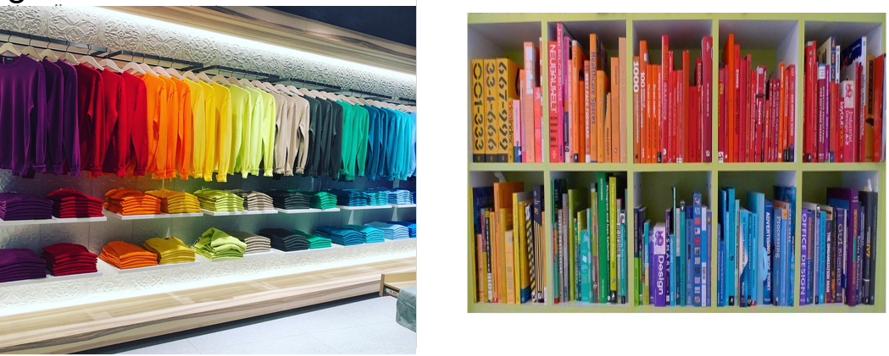

# Motivación

## 1. ¿Por qué estudiar Estructuras de Datos?
En la vida siempre tenemos “colecciones” de elementos (datos) y no necesariamente los tenemos con algún tipo de "orden".

Ejemplo 1. 

Ejemplo 2. 

Ejemplo 3. 

## 2. Los elementos de la vida, los preferimos ordenados

Si bien ordenar nuestros objetos conlleva una tarea no siempre "fácil", es mejor tenerlas ordenarlas para poder tener acceso a los objetos de manera general.

Ejemplo 1. 
 

Ejemplo 2. 
 

Ejemplo 3. 

## 3. ¿Qué reglas de almacenamiento-organización se siguen? ¿sirven las mismas reglas a todos los datos?

Hay muchas formas de organización de objetos dentro de una colección, sin embargo no todas estas formas sirven para todos los datos, depende de la naturaleza de los objetos y lo que se quiere hacer con ellos.

Ejemplo 1. 

En el ejemplo se muestra una organización de los datos por color, para la ropa en muchas ocasiones eso es muy útil y conveniente para clientes de una Store, sin embargo la mismas reglas aplicadas para organizar a libros, parace no ser tan recomendada en la mayoría de los casos.

