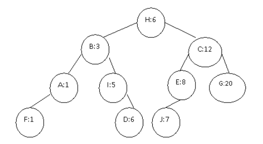

# Problema del empaquetamiento mínimo

Se desea empaquetar **n** objetos en contenedores de capacidad **c**.  
Para resolverlo, podemos usar un árbol binario de búsqueda o AVL con duplicados y ejecutar el método en **O(n log n)**.
En esta solución particular, el árbol contendrá un nodo por cada contenedor que se encuentre en uso y que tenga una capacidad **"no usada"** diferente de 0. Supongamos que cuando el **objeto(i)** de tamaño 4 unidades, esta por empaquetarse, existen en el árbol 10 contenedores en uso que tienen algún espacio disponible, sean estos espacios disponibles: A=1, B=3, C=12, D=6, E=8, F=1, G=20, H=6, K=5 y J=7 respectivamente, nota que pueden existir dos o más contenedores con el mismo espacio disponible. Estos contenedores se almacenarán en un AVL con la configuración como se muestra en siguiente figura:

 

Para almacenar a objeto=(i) procedemos a buscar desde la raíz un contenedor disponible donde este objeto "entre" bien. La raíz h tiene una capacidad no usada de 6, como objeto(i) cabe muy bien en él, el contenedor h se vuelve el candidato para el mejor empaquetamiento, sin embargo debemos continuar con la búsqueda tratando en encontrar una "mejor opción". Sabemos, por las propias reglas de ABB, que no tiene sentido seguir buscando un mejor empaquetamiento hacia la derecha de h, ya que se encuentran elementos mayores de 6, pero en nuestra búsqueda de un mejor empaquetamiento seguimos buscando por la izquierda, verificando si encontramos un contenedor donde al almacenar a objeto(i), el espacio que deje libre se acerque más a 0. Al llegar a B y no ser candidato, nos movemos hacia la derecha encontrándonos a I, el cual se convierte en un mejor candidato, la siguiente búsqueda sería a la izquierda, pero al no tener ya más nodos queda I como el contenedor elegido.
En otro caso consideremos almacenar a objeto(j)=7 con 7 unidades de tamaño, empezando por H y al no ser candidato, la búsqueda se inicia hacia la derecha, tomando como mejor candidato a C, en la búsqueda de una mejor opción debemos movernos hacia la izquierda, nos encontramos con E, quien es mejor candidato ahora, en busca de uno mejor, nos movemos a la izquierda, nos encontramos con J y queda este último como el contenedor que se elije!
Cuando hemos encontrado el mejor contenedor, debemos borrarlo del árbol, reduciendo su capacidad disponible y reinsertándolo con el nuevo espacio disponible (al menos que su capacidad disponible quede en 0). Si en la búsqueda no encontramos un contenedor con suficiente capacidad para almacenar a nuestro objeto, entonces iniciamos un nuevo contenedor.

## Especificación del programa

### Entrada
La entrada será un archivo en formato de texto, con extensión .txt el que debe contener :
- Un nùmero que describa el tamaño fijo que los contenedores dispondrán.
- El nùmero de objetos a empaquetar y a continuación la lista de los objetos. Cada objeto debe tener: su id, su nombre (ejemplo: bolsa, carro, cpu, etc), su tamaño (unidades enteras, ejemplo: 4, 500, 200, 31, etc), su descripciòn (es a elección, puede incluir nombre del propietario, destino, etc). Por conveniencia supondremos que el tamaño de ningún objeto rebasa el tamaño de los contenedores
El separador de los campos será el carácter "#"

### Salida
La salida será otro archivo en formato de texto, con extensión .txt el que debe contener:
Un número que describa la cantidad de contenedores que fueron usados
Hacia abajo, de forma muy bien descrita, debe enlistar los contenedores que fueron usados (de forma ordenada) y debe tener la descripción de los objetos que contiene, también de forma ordenada con respecto al id.

### Uso del programa:
El programa deberá usarse a través de una interfaz gráfica SENCILLA, donde sólo se solicite la ejecución del programa con un botón y que muestre la salida del programa en una área de texto, osea los datos parecidos a los que muestra el archivo de salida antes descrito.

### Ejemplos
NOTA: Se incluyen en esta página ejemplos de archivos de entrada y de salida (pero única y exclusivamente como ejemplos de FORMATO de salida)
 
 

